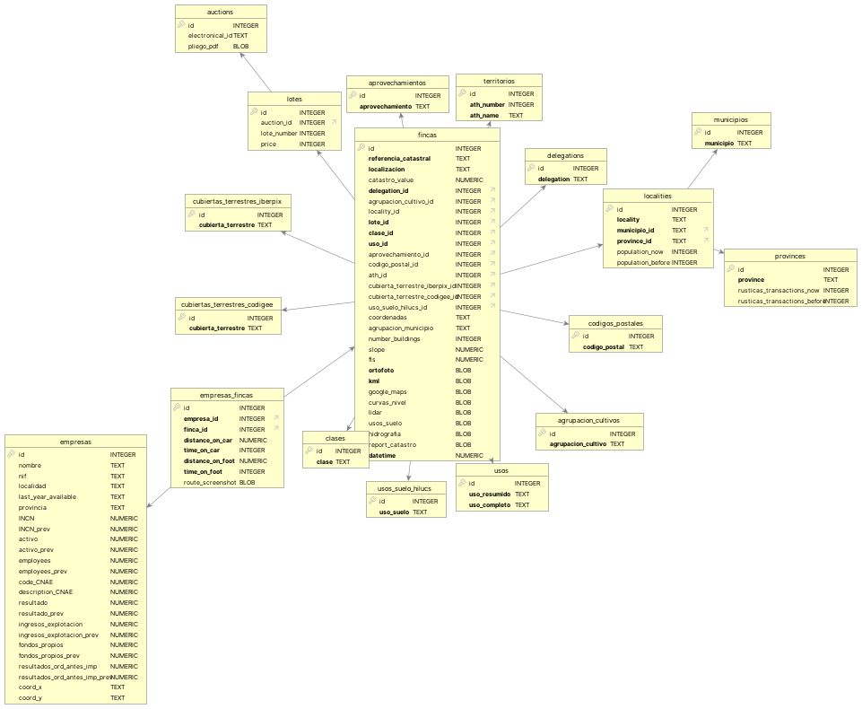
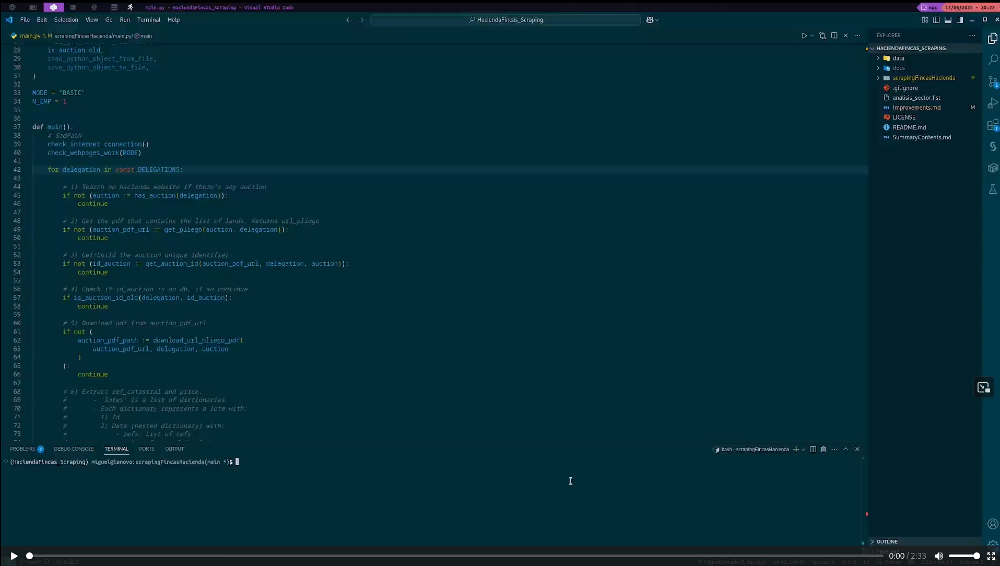

# SCRAPING FINCAS 
## Table of Contents
- [SCRAPING FINCAS](#scraping-fincas)
  - [Table of Contents](#table-of-contents)
  - [1. Motivation of the project](#1-motivation-of-the-project)
  - [2. Development process](#2-development-process)
  - [3. Implementation](#3-implementation)
    - [3.1. Logic](#31-logic)
      - [3.1.1. High-level explanation of the logic of the program **(HACIENDA)** version](#311-high-level-explanation-of-the-logic-of-the-program-hacienda-version)
      - [3.1.2. High-level explanation of the logic of the program **(TXT)** version](#312-high-level-explanation-of-the-logic-of-the-program-txt-version)
    - [3.2. Parameters choosed by the user](#32-parameters-choosed-by-the-user)
    - [3.3. Database schema](#33-database-schema)
  - [4. Considerations](#4-considerations)
  - [5. Usage](#5-usage)
  - [6. Video demonstration](#6-video-demonstration)
  - [7. License](#7-license)


## 1. Motivation of the project
+ After working as an auditor in my hometown for 3 years I saved some money. Some of the savings had been set apart for studying the Master in Barcelona. But the rest of the **savings**, I wanted to **invest them**.
+ I have always liked nature, lands...
+ At some point of those 3 years, **I decided I wanted to buy some land close to my hometown**. So, I started looking, and after a while I encountered an interesting webpage `https://www.hacienda.gob.es/es-ES/Areas%20Tematicas/Patrimonio%20del%20Estado/Gestion%20Patrimonial%20del%20Estado/Paginas/Subastas/listadosubastasconcursos.aspx`. 
  + Basically on this webpage, the **spanish goverment** publishes almost every year and for almost every region, **auctions of lands** whose owner is the government, but they are not useful for the government so they put them on auction, usually **at a cheap price** (many of these lands are the outcome of doing a `concentracion parcelaria`).
+ Fortunately, the **auction** for the lands belonging to my region **was still available** at the moment.
+ For each auction they publish a **pdf, that contains the info for all the lands that are being auctioned.**
  + The info contained on the PDF for each of the lands is the following:
    1. **Price** (always)
    2. **Catastral Reference** (always)
    3. Other stuff that is not very relevant (this part vary from auction to auction). 
+ I was particularly interested on my region's auction. In order to analyze the lands being auctioned, I had to manually look info about each land, visiting several webpages (Catastro, Google Maps, Iberpix...)
+ It took me a while, and I realized that it could be good to make an **script in order to automate the process for next times**.

## 2. Development process
+ I believe that I **started** this project 1 year ago, around **May of 2024**.
+ Finally, in **June 2025** I can say that I got a version of the project that works nowadays. 
+ My idea right now is to move on to other projects. Having said that, **I will try to maintain this project, likely the UI of some website may change in the future, and so the code to scrape it should be updated**.
+ Reflecting about it, I think it **could have taken much less time if** after starting the project I would have committed myself to do **some progress every week, or even every month**. Some days or weeks, I dedicated a good amount of coding and thinking to the project, but then I would stop for several weeks/months after get to work again on the project. After stopping, it was hard to take on again with the project, because I knew that first I should go over all of it again to catch up. 
+ Next, I will detail roughly the phases of development of the project.

| Year/Month  | Topic |
| ------------- | ------------- |
| 24/05 - 24/06 | - Scraping Hacienda website <br> - **Regex parsing of pdf contents <br> - Logic to decide which regex use to parse the pdf** |
| 24/07 | - Search about useful websites to scrape and potential ideas <br> - Figure out viability and required info to be able to scrape on each website <br> - Developing packages to scrape info on each website |
| 24/09 | - Create logic that tied all packages |
| 25/02 - 25/03 | - Database programming <br> - Code refactoring |
| 25/06 | - Code refactoring <br> - Finishing last details to get a version of the project that works |

+ I believe **it would have been better to try to get a MVP (minimum viable product) as soon as possible**, instead of trying to do all at once. It would have keep me more interested on the project, and make the development much more easier.
  + I built first all packages and then I slowly put all of them together. It would have been better to build just the necessary packages, make it work, and from there add other packages on top of it.

## 3. Implementation
+ Python
+ Selenium, BeautifulSoup (scrape)
+ Regex (parse PDFs content and other stuff)
+ Pdfplumber (plumb a PDF, basically extract contents of the PDF)
+ Sqlite3 (database) 
+ Typing (type hints)
+ Logging (logs)

### 3.1. Logic
+ In order to talk about the logic of the program, I would comment about the **2 most important parameters** that the **user has to choose**, and depending on it, the program will behave differently. 
+ Parameter: `PURPOSE`: 
  + The **project** was **originally formulated to scrape info about the auctioned lands in Hacienda website**.
  + After ending the project, I realized, that **with some minor tweaks**, I could modify the project to **also work with any list of lands provided in a user-supplied .txt file**.
  + So, this parameter `PURPOSE` is responsible for **choosing in which lands we want to scrape info about, if the auctioned lands, or some user-supplied lands**.
+ So, this parameter **can take one of the next values: "HACIENDA", "TXT"**
+ Parameter: `MODE`:
  + Several months ago, all the packages were working.
    + Each package handles the scraping of a different website.
  + This days, when I was finishing the project I realized that some of the packages weren't working. 
    + Particularly the **GoogleMaps package doesnt work, and as well as a consequence other packages cannot be executed**. 
      + The problem is that **GoogleMaps has improved its bot detection**, and there is not an easy fix to that problem, at least to the best of my knowledge (the fact that I havent learnt a lot about handling bot detection, also makes it harder). I mean, for sure that there is some workaround, but I would have to spend some time learning about it, and right now I just want to get the project, or at least the essential part of it done. 
      + **Another potential solution** would be to use the **API of GoogleMaps**. 
        + But honestly, after all this time with the project, I don't feel like going through all the documentation of GoogleMaps API. Nowadays I prefer to spend the time learning maths, or doing some cloud, programming courses.
    + Thankfully, **the info scraped by GoogleMaps and related packages, is not very relevant**, so the program is still quite useful even without the info scraped by those packages.
    + Because of that, I decided that **a good solution**, could be to introduce the **parameter** `MODE` that **handles in which mode the program should be executed**. 
      + **BASIC** mode: **Program is executed using all** packages **except** the ones that doesn't work (**GoogleMaps and related**). Despite not using some packages the program works fine, the only difference is that we scrape less info and so our database will have less info about the lands.
      + **ADVANCED** mode: **Program is executed using all packages. Nowadays, this mode doesn't work**, because of what I mention before about GoogleMaps and related packages.

| Mode | Packages used | Packacges not used |
| ---- | ---- | ---- |
| BASIC | - Hacienda <br> - Catastro <br> - Iberpix <br> - Database | - GoogleMaps <br> - Sa_-_bi <br> - Correos <br> - Ine |
| ADVANCED | - Hacienda <br> - Catastro <br> - Iberpix <br> - Database <br> - GoogleMaps <br> - Sa_-_bi <br> - Correos <br> - Ine | |


#### 3.1.1. High-level explanation of the logic of the program **(HACIENDA)** version
1. First of all, we call some **functions** that **handle the sad path** (check possible connections errors and that all the classes, functions of our packages works properly).
   + With scraping, it may happen that the scraped webpage gets some update, and so the code that scrapes that webpage has to be also updated.
2. We check in `Hacienda webpage` the available auctions for all the regions of Spain and **download their PDF's**.
    + The PDF contains all the necessary info about the lands of the auction.
3. We **extract** the desired **info** from the PDF's (price and catastral reference)
4. For each of the lands, we use the aforementioned info, to search them on some websites and get more details about them. In order to get more details we use the following websites:
   + Catastro (coordinates, ortofoto, kml, and other data) 
   + Correos (cp, municipe, locality)
   + INE (statistics about the municipe where the land is located)
   + IBERPIX (contour line map, lidar map, allowed uses map, hidrography map and some other data)
   + Sa_-_bi (near companies)
   + Google Maps (satellite images about the land, and data about the distance and time between companies and the land)
5. After extracting the correspondent info for a land, we insert all the information in our database.

#### 3.1.2. High-level explanation of the logic of the program **(TXT)** version
1. Do step 4 and 5 of previous section for the lands provided by the user on the `.txt` file.

### 3.2. Parameters choosed by the user
| PARAMETERS | VALUES IT CAN TAKE | FILE WHERE PARAMETER IS DEFINED| EXPLANATION |
| --- | --- | --- | --- |
| MODE | ["BASIC", "ADVANCED"] | main.py | Previously seen |
| N_EMP | [1-25] | main.py | Number of companies to scrape when using `Sa_-_bi` class 
| PURPOSE | ["HACIENDA", "TXT"] | .env | Previously seen |
| TXT_FILE | Path of txt file if used | main.py | File containing user-supplied lands (only necesssary when PURPOSE = "TXT")

### 3.3. Database schema
The design of the database follows a **star schema**, where `fincas` is the fact table surrounded by dimension tables.
 

## 4. Considerations
+ I have created a job, so that the script with parameters PURPOSE = "HACIENDA" and MODE = "BASIC" is executed every week
1. Edit your crontab (it would be better to have a separate user for this)
```sh
crontab -e   
```
1. Add the following line to the file:
```sh
@weekly /absolute_to_your_script
```
1. Give permissions of execution to your script
```sh
chmod +x /absolute_to_your_script
```

## 5. Usage
1. Create and activate a virtual environment
```sh
python3 -m venv venv
source venv/bin/activate
```
2. Install dependencies
```sh
pip install -r requirements.txt
```
3. Execute script
```sh
cd /whatever_path/ScrapingFincasHacienda/scrapingFincasHacienda
python main.py
```
4. Analyze and inspect as wished data stored on database 

## 6. Video demonstration
+ Small video showing the correct execution of the project, particularly of the `main.py` with the mode = "BASIC"
[](https://vimeo.com/1097274698/4e5453e1b0?share=copy)

## 7. License
This project is licensed under the MIT License - see the [LICENSE.md](LICENSE.md) file for details